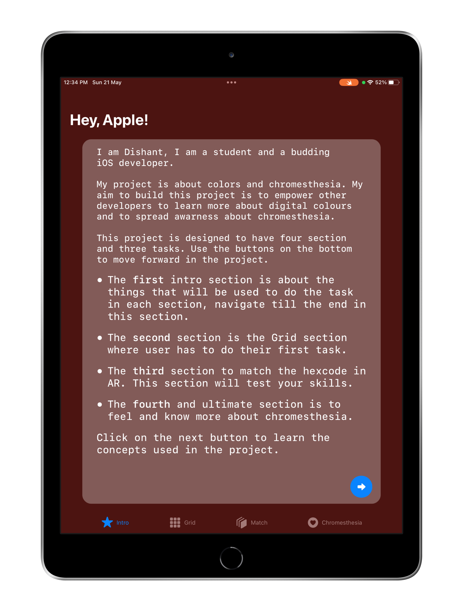
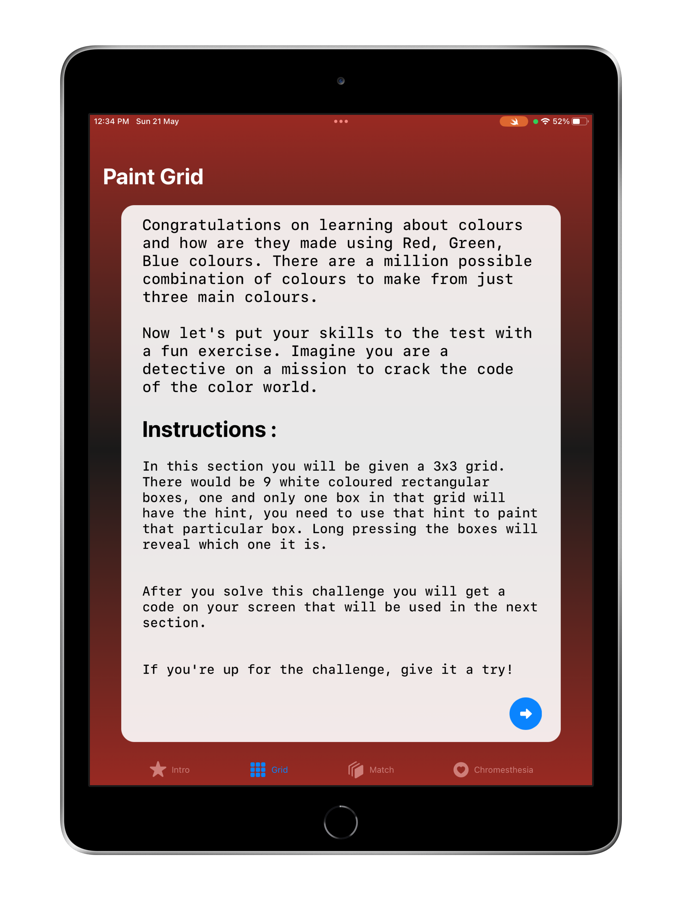
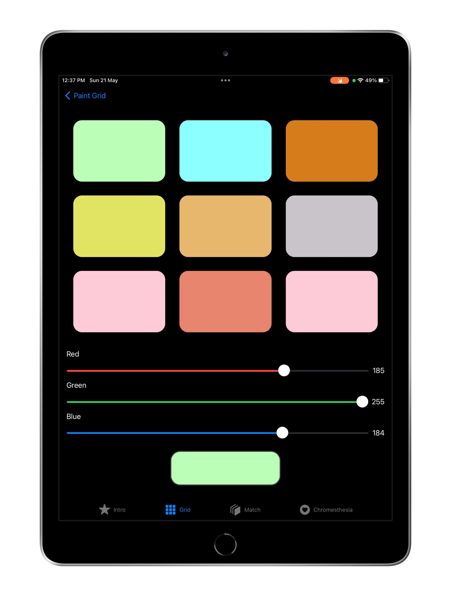
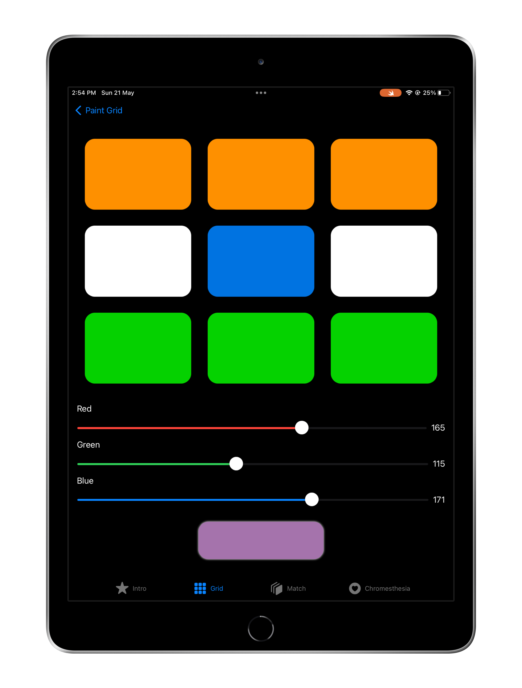
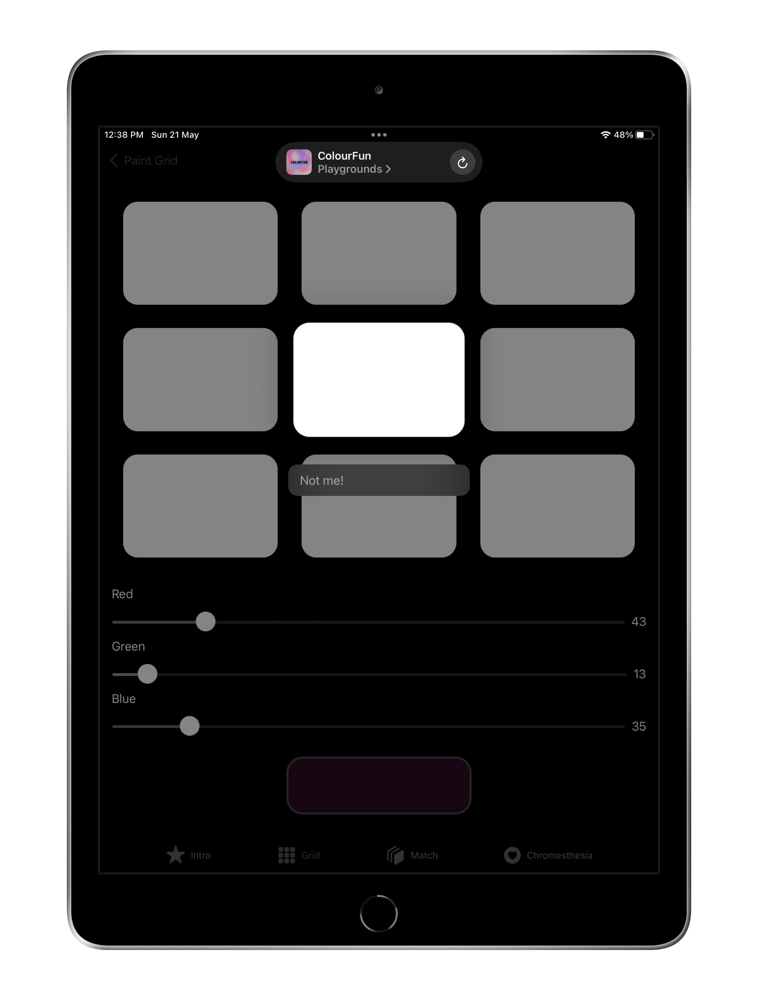
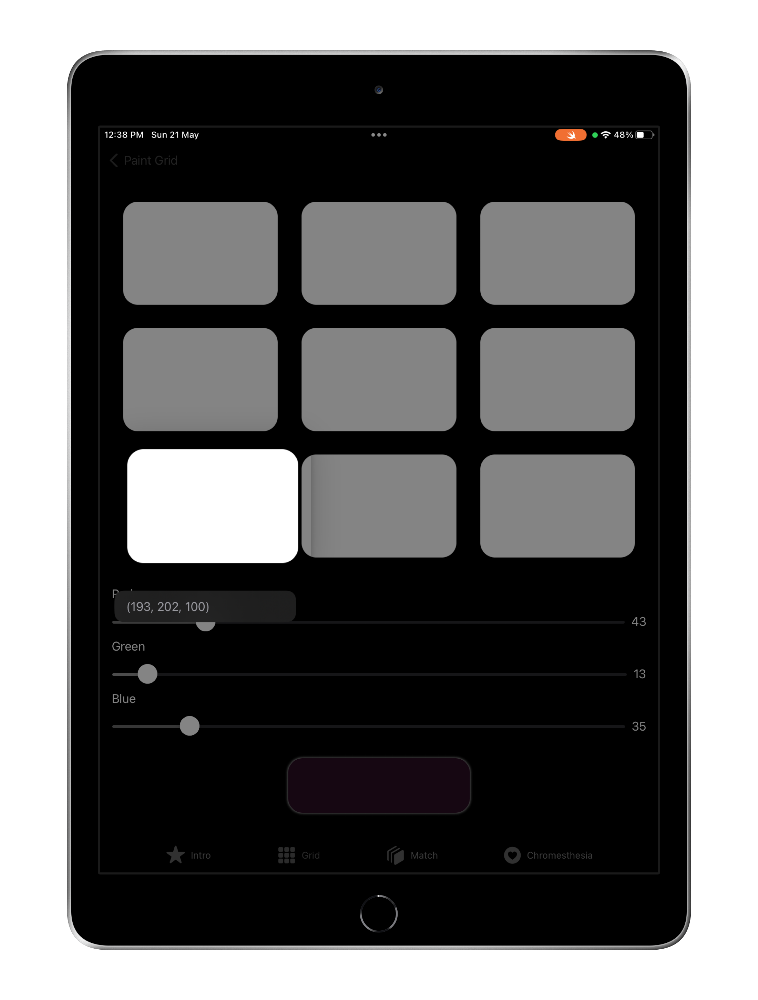
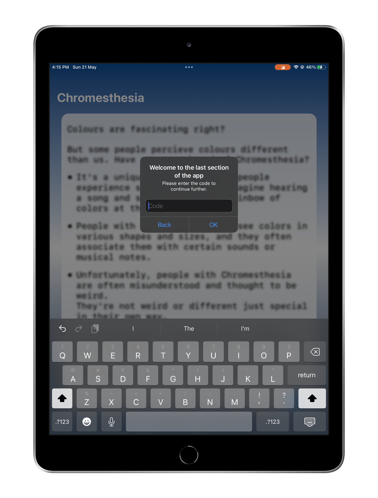
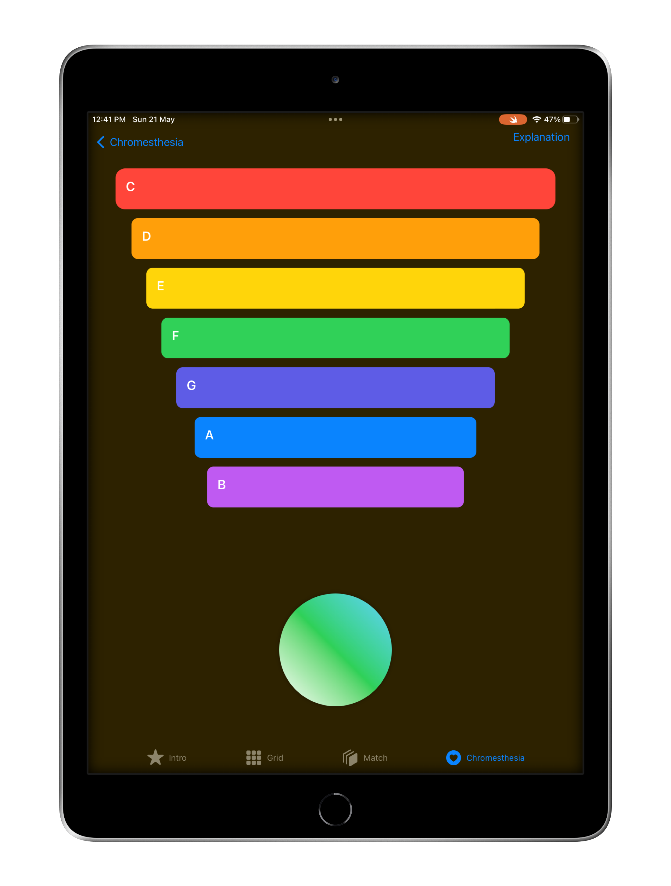
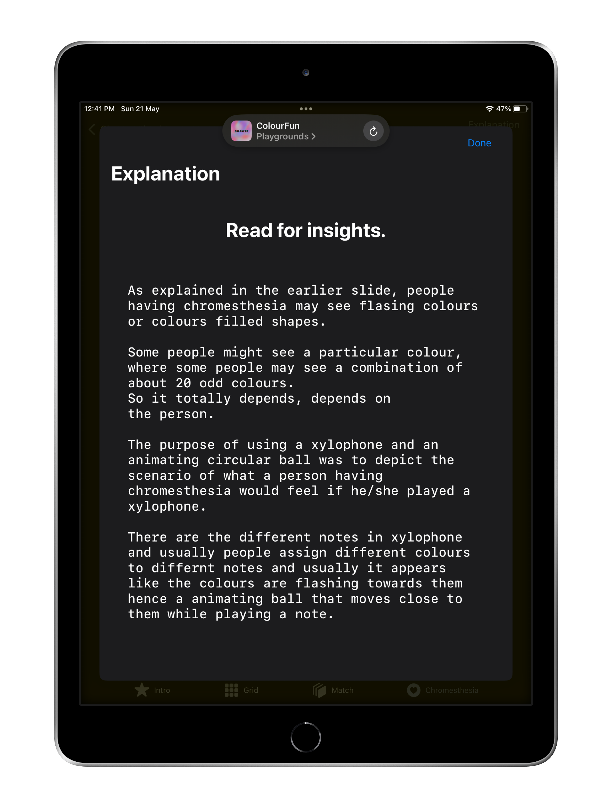
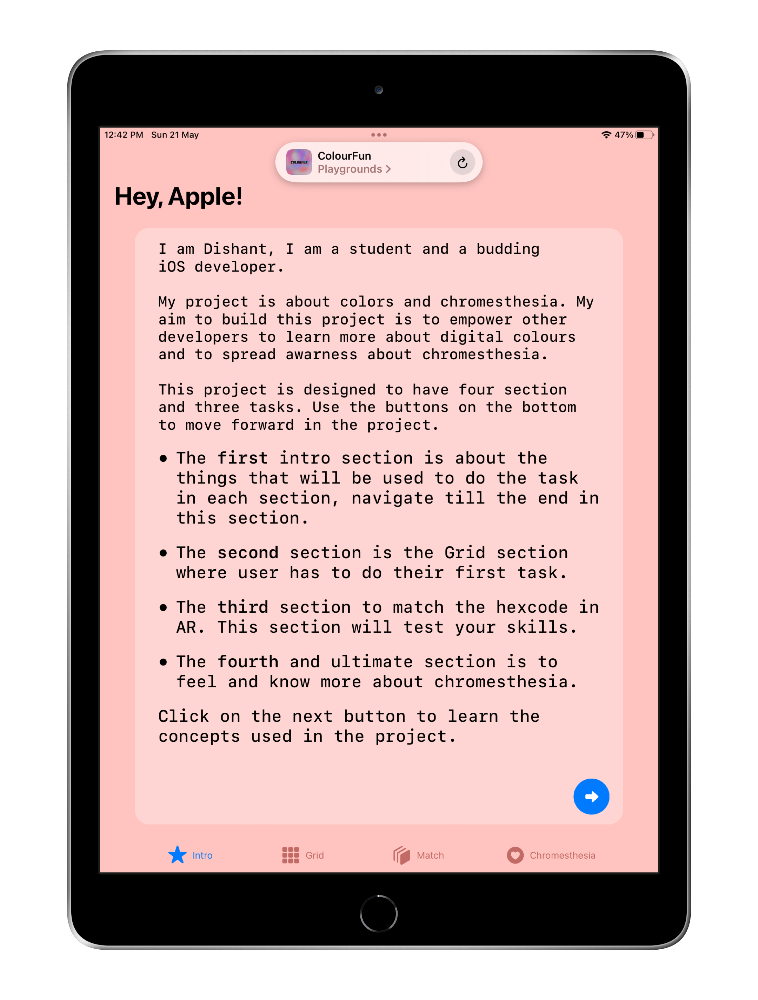

# ColorFun [Accepted]

This playground app is the winning submission for the Swift Student Challenge 2023. My submission was about colors and chromesthesia. The app tries to educate users about how colors are used in the digital space and how they are mixed together to make all the colours we see on our screens. The app includes an excersice over the RGB model, to color a cell based on the hint the user is supposed to find by long pressing the cells in the grid of all white cells. The next activity takes the user into augmented reality space, which expects the user to match a hexcode to its appropriate colored block with the RGB codes given for all the colors. The next and last section of the app makes the user experience what a person with chromesthesia would feel if they ever played or listened to a xylophone.
Do try the swift playground app project and let me know how you feel about it.

# Installation

## For iPad

Just download the zip file from this repo and open the file using the swift playground app on your iPad.

## Xcode

Clone this repo and open the .swiftpm file using xcode. The AR functionality won't be available on the mac but all the other features will work as expected.  

# ScreenShots

# Video Demo

 

# Suggestions

I'm open to any suggestion towards the app idea or the code. If anyone wants to fix any bug you encounter while using the app please feel free to open a new issue and raise a PR towards it.

# Other winning submissions

To view other winning submissions or to connect with other scholars visit the wwdcScholar website. You'll find me too there.
[wwdcscholars](https://www.wwdcscholars.com)

# License
This project is licensed under the MIT License. See the [LICENSE](https://github.com/Dishant10/ColorFun/blob/main/LICENSE) file for details.
